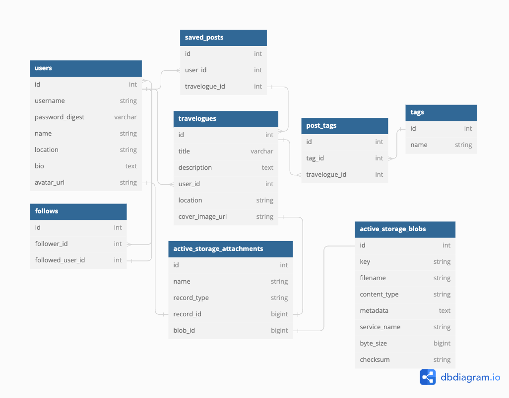

# Phase 5 project: Travelogue

Travelogue is a travel blog app that allows users to discover stories from around the world. It was build with a Rails API and a React frontend.

# Getting Started

This project was cloned from [this](https://github.com/learn-co-curriculum/project-template-react-rails-api) template, which is scaffolded to allow building a React frontend and Rails backend together. It has been configured to enable deployment of the app to Render.

Setting up your environment:

Ruby version 3.1.4 is recommended. If you need to upgrade you can install it using your preferred Ruby version manager:

    $ rvm install 3.1.4 --default
    or 
    $ rbenv install 3.1.4 --default

You should also install the latest versions of bundler and rails:

    $ gem install bundler
    $ gem install rails

Verify you are running Node 16:

    $ node -v

If your Node version is not 16.x.x, install it and set it as the current and default version with:

    $ nvm install 16
    $ nvm use 16
    $ nvm alias default 16

Fork and clone this branch to set up your local copy.

# Preliminary installs:

Installs the required gems:
### `bundle install` 

Create your db:
### `rails db:create` 

Gets your db all set up with the latest schema:
### `rails db:migrate` 

Sets up some seed data to help you get started:
### `rails db:seed` 

Installs Rails ActiveStorage to handle image uploads.
### `rails active_storage:install`

### `React`
The app front-end was built with ReactJs:
    "react": "17.0.2"

### `React Router Dom`
The app routes were set up using React Router Dom v6:
    "react-router-dom": "6.6.2"

This app makes use of Material UI components and icons:

### `npm install @mui/material @emotion/react @emotion/styled`
### `npm install @mui/icons-material`

Add autosuggest-hightight (a small (1 kB) utility for highlighting text in autosuggest and autocomplete components)
### `npm install autosuggest-highlight --save`

Installs TinyMCE rich text editor
### `npm install --save @tinymce/tinymce-react`

Install react-html-parser (to display TinyMCE HTML in React JSX)
### `npm install html-react-parser --save`

In the project directory, you can run:

### `rails s` 
to run the backend on http://localhost:3000
### `npm start --prefix client` 
to run the frontend on http://localhost:4000

## Features

Travelogue features a sign up page to create a new account and a login page to log in with existing credentials. Logged out users can browse, search and read travelogues. Once logged, in you'll have access to full feature set:

- Profile
    - Profile can be edited: name, location, bio, and avatar image.
- Travelogues
    - Track you travelogues sorted by published date.
    - Publish, edit or delete travelogues
    - Travelogues support tags, location, cover images, and rich text descriptions.
- Bookmarks
    - Track saved travelogues.
    - Travelogues can be saved or unsaved by clicking the bookmark icon found on the travelogue card while browsing.

All actions are set to persist via the back-end.

## ERD

The database tables were set up using Active Record migrations. Any changes to the database should be done via Active Record migrations. The schema.rb file will contain the latest state of the database.

## App Demo

Check out a demo of Travelogue [here](https://youtu.be/OtMjASLNw6g).